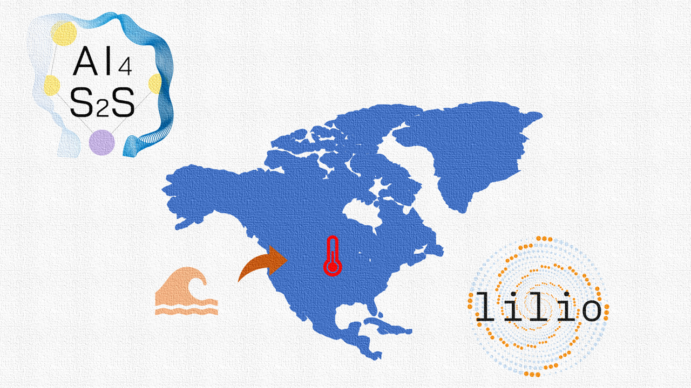

# cookbook
## Recipe for building and executing your workflow with `s2spy` suite.
This repo provides several tutorial notebooks showing how [`s2spy`](https://github.com/AI4S2S/s2spy) and [`lilio`](https://github.com/AI4S2S/lilio) can faciliate your data-driven (sub)seasonal (S2S) forecasts workflow.



## Basic workflow
Here is an example of a basic data-driven S2S forecasts workflow for regression modelling with [`s2spy`](https://github.com/AI4S2S/s2spy) and [`lilio`](https://github.com/AI4S2S/lilio).

1. Define calendar
2. Prepare your data <br>
Precursor: sea surface temperature (SST) from ERA5 <br>
Target: US surface temperature (T2M) from ERA5
3.	Map the calendar to the data
4.	Train-test split based on the anchor years-> 70%/30% split (outer cv loop)
5.	Mask the data to get only full training years
6.	Fit (out of sample) preprocessing (incl. detrend, remove climatology, rolling mean) to the masked data
7.	Preprocess all data
8.	Resample all data to the calendar
9.	Train-test split based on the previous split (outer cv loop -> inner cv loop)
10.	Dimensionality reduction
11.	Fit the ML model (Ridge) and transform to the test data
12.	Evaluate the results (skill metrics, visualization) and workflow (time and memory usage)

This workflow is illustrated below:


Similarly, you can adapt this recipe to your deep learning workflow with a few changes. You can find several examples in the next section.

## Tutorial notebooks

The tutorial notebooks include a case study in which we attempt to predict surface temperature over US using the SST over Pacific. We use processed ERA5 fields to perform data-driven forecasts. More details about the data can be found in this [README.md](./data/README.md).

Before playing with these notebooks, please make sure that you have all the dependent packages installed. For example, create a new environment with Python >3.8 and <3.11. 
```sh
conda create -n s2scookbook python=3.10
```
You can simply install the dependencies by going to this repo and run the following command:
```sh
pip install .
```

Below are recipes with different machine learning techniques:

Predict surface temperature over US with SST over Pacific with [`s2spy`](https://github.com/AI4S2S/s2spy) and [`lilio`](https://github.com/AI4S2S/lilio):
- [Data-driven S2S forecasts using linear regression](./workflow/pred_temperature_ridge.ipynb)
- [Data-driven S2S forecasts using LSTM network](./workflow/pred_temperature_LSTM.ipynb)
- [Data-driven S2S forecasts using autoencoder network](./workflow/pred_temperature_autoencoder.ipynb)
- [Data-driven S2S forecasts using transformer with multi-head attention](./workflow/pred_temperature_transformer.ipynb)
- [Data-driven S2S forecasts using LSTM network with linear regression as baseline](./workflow/comp_pred_ridge_and_LSTM.ipynb)
